# ManageBac-Buddy

**把散落在四个平台上的学习信息，收进一个窗口。**

一块写给高中生的 macOS 综合看板：作业、成绩、课表、Teams 消息、English Corner 名单，一屏看完。优先适配北京一零一中学国际部；其他 IB / A-Level / AP 体系的学校，替换抓取规则后同样能用。

<a href="https://github.com/OscarOZK/managebac-buddy/releases/download/v3.5/ManageBac-Buddy-3.5.dmg">
  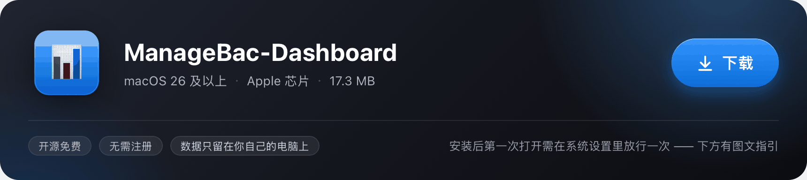
</a>

### ↓ [点此下载 ManageBac-Buddy-3.5.dmg](https://github.com/OscarOZK/managebac-buddy/releases/download/v3.5/ManageBac-Buddy-3.5.dmg)

macOS 26.0 及以上 · Apple 芯片 · 34.6 MB · [查看全部版本](https://github.com/OscarOZK/managebac-buddy/releases)

> **从 v3.0 升级？** 它现在叫 **ManageBac-Buddy**（原名 ManageBac Dashboard）。名字只换了这一处，装上去之后你的课表、成绩、四个账号的登录态都会自己跟过来——不用重登，也不用重新导课表。

---

## 装好之后，先放行一次

这个 App 没有使用 Apple 的付费开发者签名，所以第一次双击时，macOS 会拦一下。这是系统的常规保护，不是 App 出了问题——跟着下面三步走一遍，之后就不会再拦。

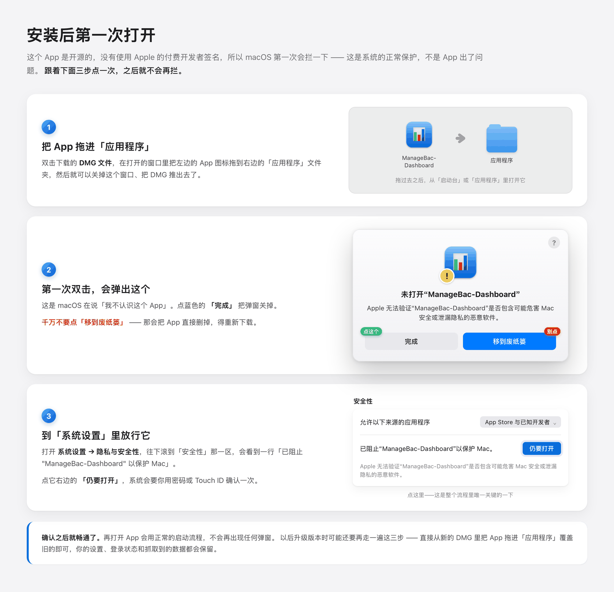

一句话版本：**拖进「应用程序」→ 弹窗里点「完成」→ 系统设置的「隐私与安全性」里点「仍要打开」。**

其中第二步的那个「移到废纸篓」按钮千万不要点，它会把 App 直接删掉，得重新下载。

---

## 起点

我是北京一零一中学国际部的高中生。

国际部的日常有一个不起眼、但每天都在消耗人的麻烦：作业在 ManageBac，通知在 Teams，活动安排躺在邮箱里，课表是另一份要单独打开的文件。想确认一件事——比如「明天第一节在哪间教室」「那份报告还剩几天」——得在四个入口之间来回切换。而每一次切换都是一次注意力的断裂：为了查一个截止时间切出去，登录、翻页、找，回来时已经不记得刚才写到哪了。

于是有了这个综合看板，让同学们可以无障碍地查到最新数据。

后来发现，仅仅「有一个地方能看全」还不够。只要它是一扇需要主动推开的大窗口，就会打断手上正在做的事。所以在状态栏上又放了一块**点按即出的小看板**：想看数据，点一下，扫一眼，收起来——**既保持心流不断，又能拿到最新数据。**

这就是它的全部动机。此后每一处改动该不该做，判断标准也只有这一条：它有没有减少一次注意力的断裂。

---

## v3.5：把「需要你先准备好」这件事，从 App 里删掉

v3.0 是一个能装、能跑、能看的版本。但它有一个说不出口的前提：**你得先有一台合适的环境。**

要有能用的 Python，要有 Chromium，要能忍受第一次连接时那 150MB 的下载。开发机上这些东西碰巧都在，所以一切看上去很正常；而换到别人的电脑上，四个集成里只有一个能登进去——偏偏那一个，是唯一不需要后端的。

v3.5 做的全部事情，就是把那个前提删掉。

不是给用户写一份更详细的准备清单，而是让 App 自己带上它需要的一切。**能自己背的东西，就不该让使用者去搬。**

### ① 浏览器搬进了 App 的身体里

看板有三条链路非要一个真浏览器不可：ManageBac 的填表登录、Teams 的令牌读取、希悦的登录与导出。以前它们共用一个外部 Chromium——而别人电脑上十有八九没有，作者这台开发机也没有。

这一版把浏览器请进了屋里。App 用 macOS 自带的 WebKit 起一个**内置网页引擎**，托管在窗口里；Python 那一侧拿到的是一个与 `agent-browser` 完全兼容的命令行外壳，于是三条业务链路**一行业务代码都不用改**，只是换了个「去哪儿取浏览器」的答案。

| | v3.0 | v3.5 |
|---|---|---|
| 浏览器 | 外部 Chromium（Chrome for Testing） | App 内置 WebKit |
| 首次等待 | 下载约 150MB，国内常只有镜像通得了 | **0 字节** |
| 没装浏览器的电脑 | 三个集成全部失败 | 照常登录 |

登录页就摊在窗口上，你不需要知道背后有个隐藏的浏览器。它和看板共用同一套配色、圆角、玻璃与密度零件，换主题时它跟着一起变，不会像贴上去的外挂。

### ② 后端不再借你的电脑

数据全部来自本机的 Python 桥接服务。以前它只能指望「你这台电脑上恰好有个能用的 python3」——而这条假设在普通 Mac 上并不成立：系统自带的 `/usr/bin/python3` 只是一层壳，真正干活的是 Xcode 命令行工具里的那一份，没装的机器上跑它会先弹一个系统弹窗，然后退出。

这次 App 直接背了一个完整的 Python 运行时（3.12.11 / 42MB / 自带标准库 / 可重定位）。后端只用标准库，所以不需要 pip，也不需要网络。**这一类失败从此不存在。**

同时清掉了分发路上的几处硬坑：

- **隔离标记**：用 `removexattr` 递归清掉包内文件的 quarantine——「右键打开」只清 App 顶层，包内那份标记还在，而它会让包内二进制**拒绝执行**。1600 个文件 0.06 秒。
- **可重定位**：清不掉就整个搬到数据目录。这里有个细节：`cp -R` 会把 xattr 一起带走，搬了等于白搬，所以是读进内存再写出。
- **只有 5 个文件会被拦**：包内 1598 个文件里，真正会被 Gatekeeper 拦下的 Mach-O 只有 5 个——与构建脚本单独签名的那 5 个完全一致，可以交叉验证。

### ③ 让登录回到「不必被注意」的样子

好用的东西是没有存在感的。你不会记得今天按过几次开关，只会在灯不亮的时候才察觉不对劲。登录本该如此——按下去，进去了，然后你把它忘掉。

这一版把登录路上那些**会让人以为自己错了**的地方，一条条改直了。

| 从前 | 现在 |
|---|---|
| 冷启动时占位数据写着 `loggedIn: true`，「还没抓到」被显示成绿色「数据已就绪」，屏幕却一片空白 | `loggedIn` 是三态：`false` 明确掉登录、`true` 明确能取到、`nil` 还不知道。不知道就老实说「读取中」 |
| 后端起不来 → 8 秒后必然连不上 → 弹「登录失败，请检查账号密码」 | 先等到服务真的可用；一旦拿到「为什么起不来」，当场说清 —— 和你的账号没关系 |
| 客户端等 90 秒就判超时，而服务端的正常路径最坏要走 120 秒 | 余量给到 180 秒。**服务端还在干活，客户端不该先宣布失败** |
| 把 agent-browser 的英文原始报错直接吐在界面上 | 翻译成一句能照做的话 |
| 引导页教你填「学号或邮箱前缀」 | 改成学校邮箱全称（要带 `@`）。原来那句话，是在教用户填一个登不进去的值 |

登录失败其实只有两种：一种是真的没登进去，一种只是**界面以为**你没登进去。前者你使不上力，后者不该由你来承担——这一版能做的，是把后一种一点点磨掉。

写这类工具的人很容易有一种错觉：**报错信息也是给同行看的**。不是的。用户看到那句「请检查账号密码」时，唯一会做的事就是去改密码——而真正的原因，可能是这台电脑上没有 Python。

### ④ 门铃只在你按下按钮时响

希悦的课表要从你导出的 Excel 里读，所以后端需要去「下载 / 桌面 / 文稿」里找那张表。而 macOS 的规矩是：**只要被列一次目录，就立刻弹授权框。**

后端是随 App 一起起来的，比主界面还早。于是从前的画面是：你刚坐下，界面还没铺开，一个系统弹窗已经盖了上来。

现在这条路被分成了两档：

- **窄扫**：后台日常只看自己的导出目录。不碰你的任何文件夹，**不会触发任何授权框。**
- **宽扫**：只有你主动点「导入课表」时才展开，而且还要等一句「用户已经进场」的信号——那句话正是在你点下「让我们开始吧」的那一刻发出去的。

它还留了一道两分钟的兜底：万一那个信号丢了，两分钟后自己放行，不会永久卡住。

### ⑤ 动起来的每一处，都是想清楚过的

动画很容易滑向两个极端。一边是没人想过的装饰——转场随心情加一点弹性，界面于是显得轻浮；另一边是没人敢碰的雷区——谁都不知道动它会不会牵一发动全身，于是它僵在那里，一年比一年旧。

这一版把散落在二十几个文件里的时长、缓动与弹性，收进了同一个抽屉，抽屉分三层：

- **一个总开关。** 「减弱动态效果」不再是个摆着好看的勾选框，它真的成了断掉所有动效的那道总闸。
- **三档性格。** 稳重、舒缓、轻快。改一个数，整块界面的节奏跟着一起变——不必每一处都去改。
- **一份语义表。** 悬停、按下、选中、翻页、数字跳动、脉冲、弹出，每一类动作各有自己的时长与曲线，而不是各自为政地写死同一个 0.2 秒。想统一调快或调慢，改一处就够。

还有一处不那么显眼、上手却能立刻感到的：页面切换现在**认方向**。往后翻和往前翻，各从各自的那一侧滑出去，不再是一律从右边硬推过来。方向对了，人就不会在切换里迷路。

（顺带交代一句：首次打开时那段一帧帧写出来的 `MB BUDDY`、和那句反复书写又被重新吸干墨水的彩虹 `hello`，**一个版本只演一次**。装了个新版本、第一次打开，它还会照旧来一遍；同一个版本里退出后台再进来，落在眼前的就是看板本身——动画是给你看一次的，不是每次开机都要重看一遍的。）

### ⑥ 玻璃要透光，也要挡光

`Liquid Glass` 好看，是因为它像真的玻璃：透得出背后的东西，又确实挡在身前。可真实的玻璃是有厚度的——光穿过时会弯折、会被吸收，还会在边缘聚成一道细亮的边。若只做成一整块半透明的颜色，它就不再是玻璃，只是一张磨砂贴纸。

这一版把玻璃从「一层糊到底」改成了三层：

- **最外一圈**交给系统原生的 `Glass.clear`：只负责折射，不上任何填色。
- **往里一层**才是毛玻璃加主题底色：糊到「不太透」，让字始终站得住。
- **最外沿**压一道高光渐变：边沿于是有了一根细小的反光，玻璃也就有了厚度。

三层各自可以调，四个可调项的默认值恰好就是原来写死的那些数——所以观感是**接着上一版长出来的**，不是换了个样子。玻璃强度跟着主题走，深色下是冷调的墨蓝，浅色下是暖白；设置里「降低透明度」一开，它又老老实实退成实色，在弱对比的屏幕上把字让出来。

### ⑦ 一个 App，一条通知

主看板与状态栏小看板以前是两个进程，共用同一份设置文件——于是同一条消息可能被弹两遍，两边的主题也可能互相覆盖。

现在它们是**同一个二进制**：同一个后端、同一份数据、同一条通知来源。不存在两边对不上的问题。

### ⑧ 其余那些看不见的整理

- **本机请求直连**：装过代理或 VPN 客户端的机器上，`HTTP_PROXY` 会把 `127.0.0.1` 也丢给代理，于是「调试端口不通」这类假故障全都冒出来。现在本机回环一律绕过代理。
- **窗口只有一个**：希悦和 Teams 共用同一扇窗。「窗口摆出来没有 / 这段时间别动它」统一记账，Teams 的后台保活不会再把你正在登录希悦的窗口收走。
- **浏览器查找统一**：三处各写一份的查找逻辑合并成一份，镜像源排候选第一位——实测比官方源快 8 倍（13.4MB/s 对 1.6MB/s）。
- **抓取等 Promise**：`scrape.js` 是 `async` 函数，而 WebKit 的 `evaluateJavaScript` **不 await Promise**。改用 `callAsyncJavaScript` 之后，抓取从「静默失败」变成 0.8 秒拿到 16 条任务、8 门课。
- **换名字不换东西**：App 与数据目录都改成了 `ManageBac-Buddy`，而改名最容易伤到的正是那些看不见的家当——595MB 的浏览器 profile、四个账号的 Cookie、你的课表与偏好。所以搬移走的是**目录改名**（同卷上瞬时完成，不复制一份占双倍磁盘），登录态则按旧 Bundle ID 逐个接过来。升级的那一次启动，它自己就知道该去接谁。

---

## 一屏之内

侧栏四个分区，覆盖国际部学生每天真正要查的东西。

| | 分区 | 回答的问题 |
|---|---|---|
| ✅ | **待办** | 现在欠什么、还剩多久、哪条最急 |
| 👥 | **Teams** | 微软任务 / 邮件 / 日程里，哪些和学习有关 |
| 🗓 | **课程** | 今天第几节、在哪间教室、谁上 |
| 📊 | **成绩** | 各科总评、GPA、最新出了什么分 |

### 待办

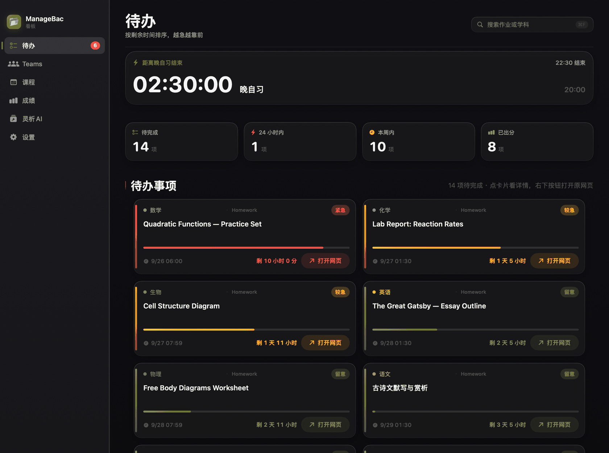

顶部是一张大计时卡——它知道你现在处于「距离晚自习结束」还是「课间休息」，按你自己的作息表切换。下面是概览磁贴（待完成 / 24 小时内 / 本周内 / 已出分）和作业卡片网格，每张卡片带一条**时间进度条**和紧急度标签：红色「紧急」、黄色「较急」、蓝色「留意」。逾期项自动收进折叠区，不会淹没眼前真正要紧的事。

同一个页面在亮色下的样子：

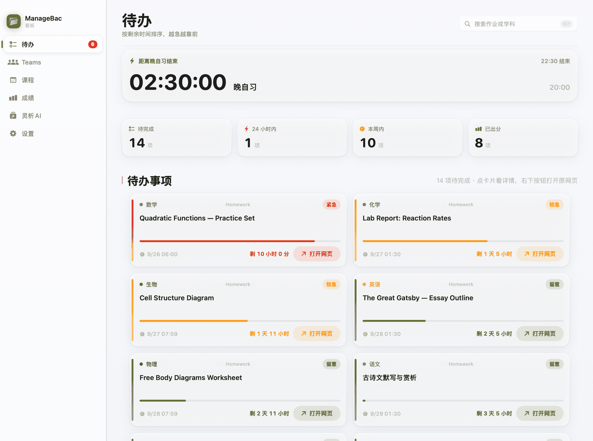

### Teams

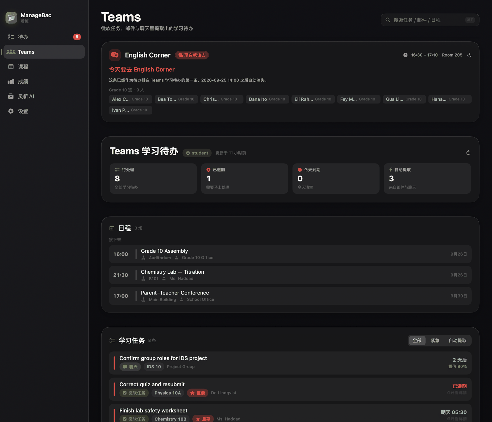

这一页做的事是**从噪音里捞出干货**。课程消息、邮件、日程里散落着真正的学习任务——一封「周四实验课要带白大褂」的邮件，本质就是一条待办。于是把微软任务、邮件、日程和 English Corner 名单横向拉通，再按课程和截止时间重新组织。

顶部的 English Corner 卡片会直接告诉你**今天要不要去、几点、在哪、名单里有没有你**。这是国际部每周都要确认一次的信息，以前得翻邮件才知道。

### 课程

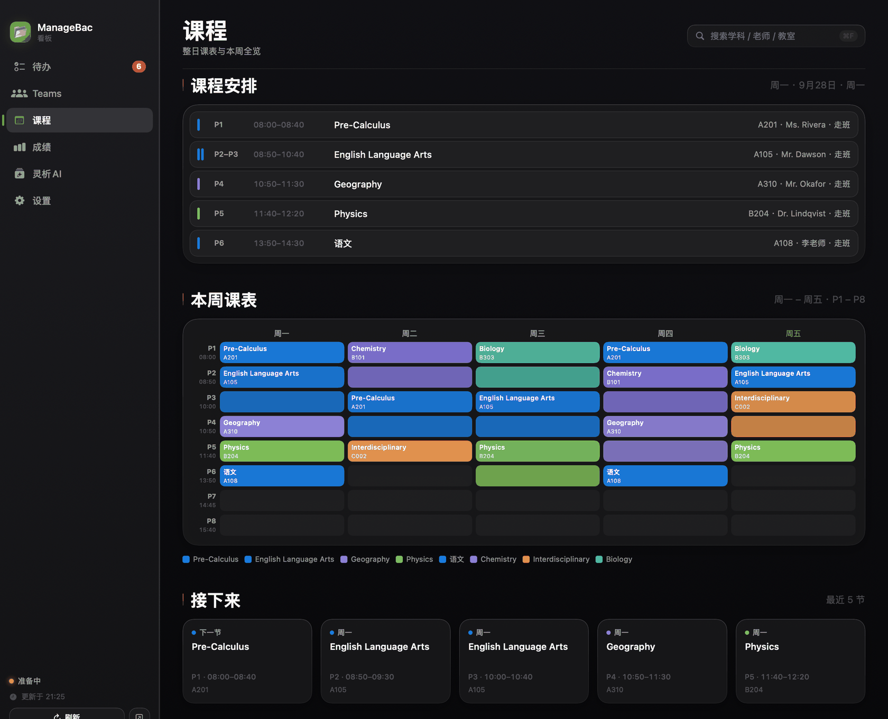

整日课表与本周全览两张视图。课表从学校导出的 PDF / Excel 里解析出来，所以「下一节是什么、在哪个教室、还有几分钟上课」是准的——不是靠手输。

### 成绩

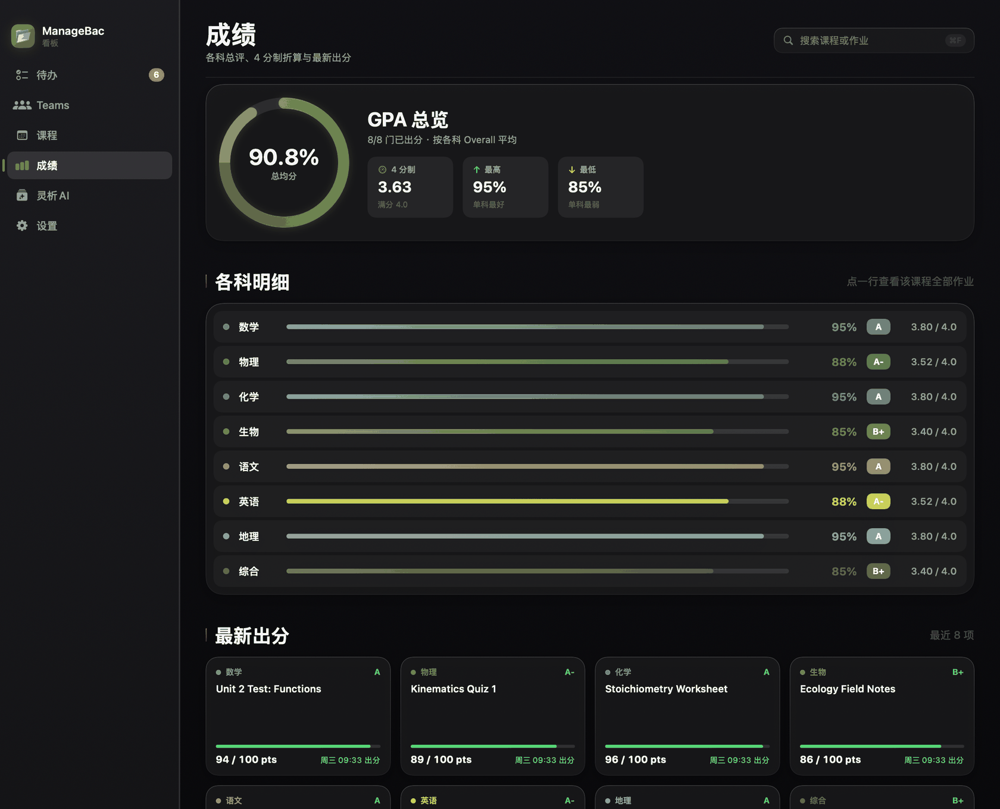

GPA 总览环、4 分制折算、各科明细，以及一条按时间排列的出分线。

---

## 值得单独讲的五处

### ① 通知：把「该知道」和「别吵我」分开

一个看板最容易失败的地方是**通知刷屏**——消息太多，用户干脆关掉通知，这个功能于是等于不存在。

所以通知这块留了足够的余地：总开关、按类型开关（作业 / 成绩 / Teams 任务 / 邮件 / 日程 / English Corner）、只提醒「紧急」档、提前多少小时提醒、学科白名单、免打扰时段、每日汇总、通知上要不要挂学科图标……

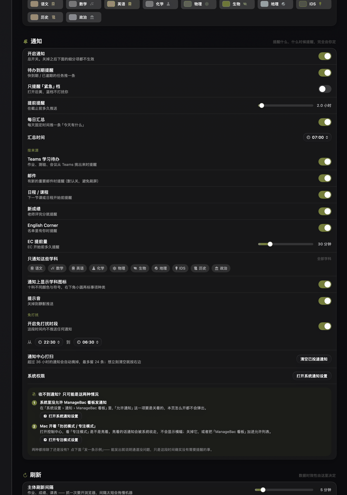

而真正决定它能不能长期用下去的，是背后这几条约束：

- **一个进程发通知。** 主看板和菜单栏面板是同一个二进制，同一条消息不会被弹两遍。
- **永久去重。** 同一个 key 见过一次就永远不再播报，刷新多少次都不会旧事重提。
- **旧闻门槛。** 新成绩超过 4 天、Teams 任务超过 3 天、邮件超过 7 天，只记账不播报——不会出现「一周前的成绩被当成新成绩」。
- **静默播种。** 首次运行或状态文件丢失时，只记录现状、一条都不补播，避免历史账本瞬间全涌出来。
- **同轮合并。** 一轮里同一类超过 2 条就合成一条汇总（「🏆 4 条新成绩」），不再逐条轰炸。

通知图标按**学科配色 × 提醒类型**生成，所以在通知中心扫一眼就知道是哪一科、什么事，不必读文字：

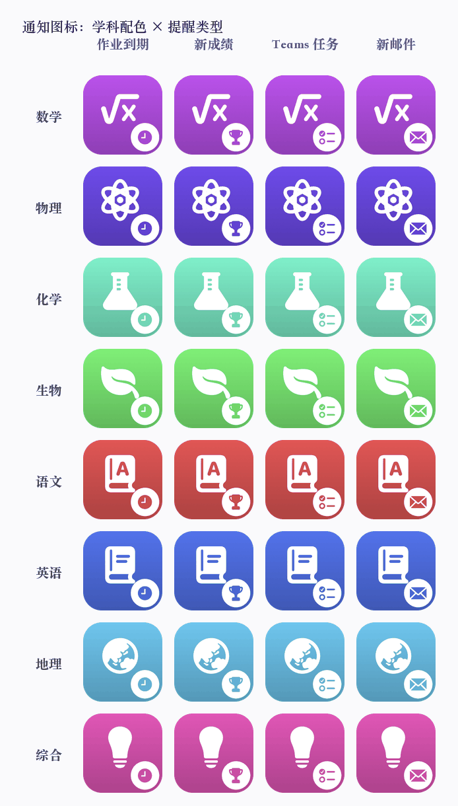

展开来看是这样：

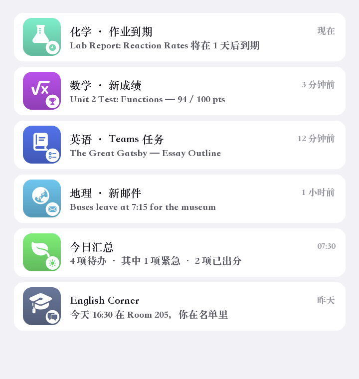

### ② 灵析 AI：让 AI 能看见你的作业

普通 AI 对话框的问题是它不认识你——你问「我这周哪天会特别赶」，它只能反问「请提供你的课表和作业」。

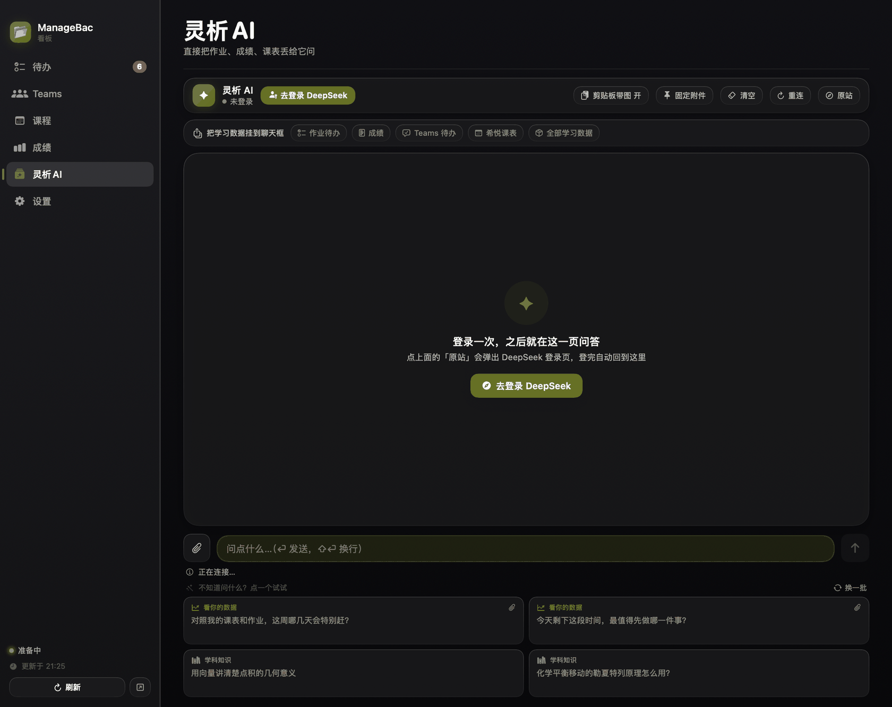

灵析 AI 把看板的数据直接挂进对话：作业待办、成绩、Teams 任务、希悦课表，都可以按需作为上下文交给它。于是它能回答的是这类问题：

> 「对照我的课表和作业，这周哪几天会特别赶？」
>
> 「我最近有没有漏掉 English Corner？下次是哪天？」

它和看板其他部分共用同一套配色、圆角、玻璃与密度零件，换主题时跟着一起变。

### ③ 主题：五套，各是一个世界

不是换几个色号，而是**成套的配色体系**——背景、卡片、边界、强调色、状态色一起换。同一页在五套主题下：

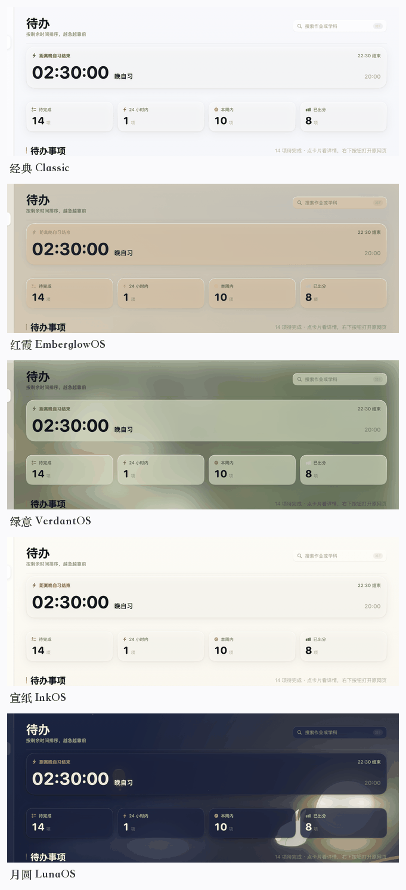

| 主题 | 气质 |
|---|---|
| **经典** Classic | 干净的蓝，最中性 |
| **红霞** EmberglowOS | 暖橙、粉与淡蓝层层过渡，校园黄昏 |
| **绿意** VerdantOS | 荷塘、林荫道的深绿与浅草绿 |
| **宣纸** InkOS | 朱砂、烟墨、月白宣纸 |
| **月圆** LunaOS | 桂影、月华、中秋夜色（深色专属） |

其中「月圆」是限时主题，带一整套可以互动的插画元素——月亮、桂枝、玉兔，夜色里还飘着桂花。它长这样：

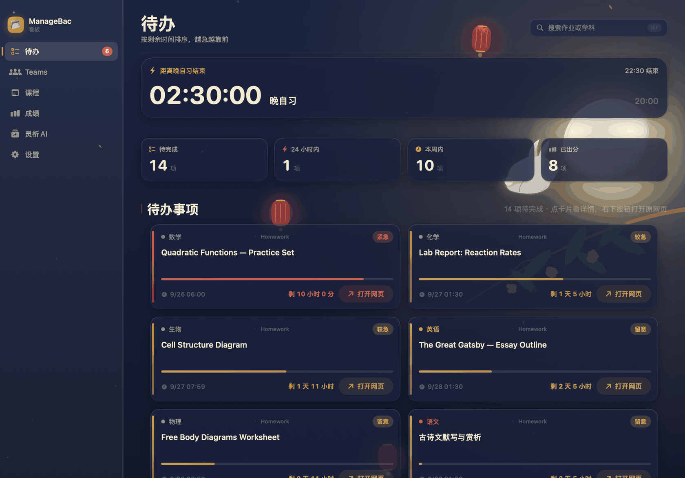

### ④ 液态玻璃：让它像个真 App

macOS 26 的 Liquid Glass 材质贯穿整个界面——卡片、侧栏、按钮、菜单栏面板都是玻璃质感，能透出背后的内容。

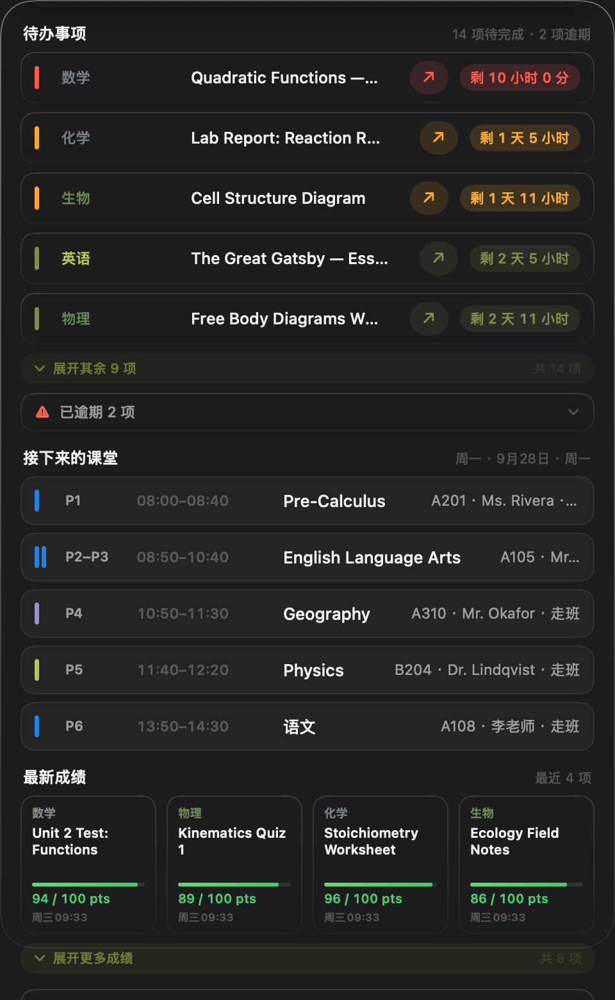

这不是纯装饰。玻璃是有层次的：越靠近你当前关注的东西越实，越背景的东西越透。深色下玻璃是冷调的墨蓝，浅色下是暖白，跟着主题一起走。

也做了无障碍上的让步——设置里的「降低透明度」会让玻璃退成实色，「减弱动效」则关掉悬停抬升与一切过渡。这两项都随点随见效。

### ⑤ 可靠性：看得见才敢信

这类看板最怕的不是功能少，而是**静默失效**——数据几天没更新、登录早过期了，界面却一切如常，你以为看到的是最新的。

所以做了几件事：

**数据新鲜度可见。** 每页都标「更新于 X 分钟前」；数据停了会明说「数据停在 …」「登录已失效，数据未更新」。宁可让你知道它坏了，也不装作没事。

**抓取失败有降级。** 拿不到新数据时，展示上一次的快照并明确标注「这是上次抓到的」，而不是清空成空态、让你以为自己没有作业。

**构建链自检。** 每次构建都会逐字节比对「打进包里的后端」和「源码」是否一致——以前踩过「改了源码但包里还是旧的」，现象是修好的 bug 原样复现，极难查。此外还会校验签名、核对包内后端模块数量。

**出厂体检。** 项目里带一份 `tools/verify_app.py`，逐项检查 App 装好之后能不能真的用：包内 Python 可执行且可重定位、冷启动不谎报已登录、没装浏览器时登录入口给的是不是人话、签名是否有效……上一次跑是 **通过 18 · 警告 1 · 失败 0**（唯一的警告是 ad-hoc 签名过不了 Gatekeeper，属必然结果）。

**渲染自检。** 项目里带一套离屏渲染工具（`--section` / `--panel` / `--live` / `--data` 等开关），可以把任意一页按任意主题、宽度、亮暗渲染成图来核对版式。其中 `--live` 会把页面放进一个屏幕外的真窗口跑几秒，逐帧比对相邻两帧——专治「定时器没在跑，但代码读起来毫无问题」这类盲区（首页那个大倒计时卡死不动，就是这么查出来的）。

**隐私默认安全。** 登录态、Cookie、浏览器 profile、抓取到的作业与课表全部只存在本机数据目录里，不进仓库。仓库里那份 `.gitignore` 的每一条都写明了「为什么不能上传」。

---

## 抬眼即见

回到最开始的那个动机——**不打断心流**。

点一下状态栏图标，弹出一块小看板：待办、接下来的课堂、最新成绩，一屏扫完。

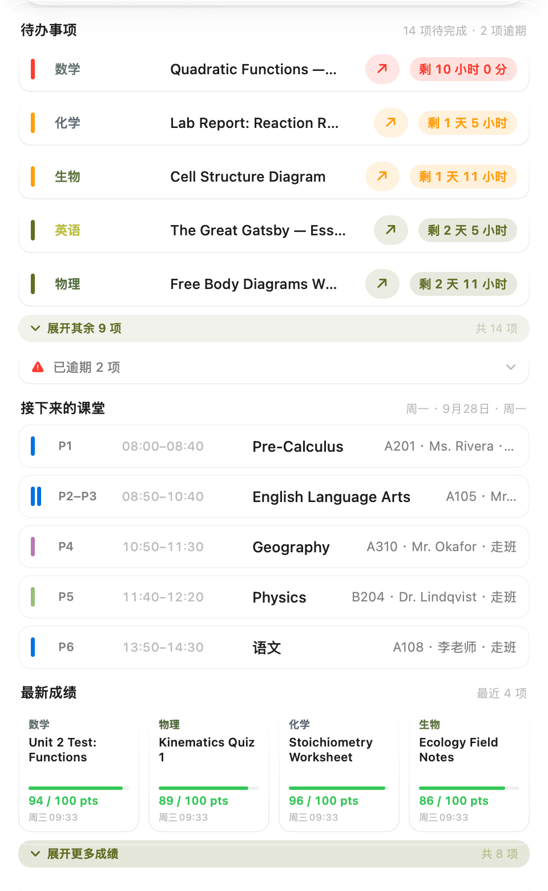

它和大看板是同一个 App、同一个后端、同一个通知来源，因此不存在两边数据对不上的问题。

---

## 怎么用

装好、放行一次之后，第一次打开会带你走一遍引导：填学校地址与账号，四个账号（ManageBac / Teams / 希悦 / 灵析 AI）**都可以先跳过**，以后在「设置 → 账号管理」里随时补。

日常其实只有三件事：

- **看** —— 侧栏依次是待办、Teams、课程、成绩、灵析 AI。`⌘1`~`⌘5` 直接跳分区，`⌘R` 立即刷新，`⌘[` / `⌘]` 前后翻页。
- **问** —— 灵析 AI 那一页用大白话问就行，作业、成绩、课表都能作为上下文递给它。
- **挂着** —— 点菜单栏图标弹出一小块看板，扫一眼收了，不打断手上正在做的事。关掉主窗口它还在，真退出走 `⌘Q`。

设置里改任何一项都会立刻反映到预览、菜单栏和整个看板；改错了，底部「恢复默认」会退回（保留你的名字与年级），「恢复新手导览」则连档案一起清空、重新走一遍。

更细的说明——每个分区在讲什么、四个账号怎么连、通知怎么配、遇到问题按什么顺序排查——都在随包附带的 [`使用说明.html`](board/mac/使用说明.html) 里。

---

## 自己动手构建

想自己编译一份，或者改点东西：

```bash
git clone https://github.com/OscarOZK/managebac-buddy.git
cd managebac-buddy/board/mac
bash build.sh
```

构建产物落在 `~/Desktop/ManageBac-Buddy/`，双击里面的 `ManageBac-Buddy.app` 就能启动。输出位置可以用环境变量改：

```bash
MBBOARD_OUT=/somewhere bash build.sh
```

打包成 DMG 安装包（用系统自带的 `hdiutil`，不需要额外安装任何工具）：

```bash
bash tools/make-dmg.sh 3.5
```

首次启动会引导你填学校地址、账号和密码。包内自带的 Python 运行时、网页引擎与抓取工具会自己就位——不需要 `npm install`，不需要预先装任何东西。

**渲染自检（可选）**

```bash
bash board/mac/render.sh --section todo --h 940 --out /tmp/x.png
```

---

## 项目结构

```
board/
  mac/          macOS 看板（SwiftUI 原生 + 多文件 swiftc 构建）
  shared/       后端共享模块（网页引擎、课表解析、希悦、EC 名单…）
  windows/      Windows 版（Electron）
menubar/        菜单栏面板（独立构建版；正式版已并入 mac 看板）
watch/          Apple Watch 版 + 表盘小组件
relay/          推送中转服务（手机端接收通知）
bridge.py       本地后端：抓取调度、登录态、缓存、推送
scrape.js       ManageBac 抓取脚本
tools/          演示数据生成、DMG 打包、HTML 转图、出厂体检
docs/           文档、截图与渲染脚本
```

Mac 版约 37 个 Swift 文件、2.6 万行 Swift；后端 `bridge.py` 约 4000 行，另有 9 个共享 Python 模块。App 体量 83MB，其中 45MB 是那份自带、可重定位的 Python 运行时。

---

## 屏幕里的数据从哪来

README 里所有截图**都是用虚构数据渲染的**。

原因很直接：GitHub 上的图片删不干净（fork、缓存、爬虫都会留档），而真实的作业标题、成绩、课表里的老师姓名和教室号，都是不该公开的信息。

所以截图流程固定为两步：

```bash
python3 tools/make-demo-cache.py    # 生成虚构数据到 docs/demo-data/
bash docs/shoot-readme.sh           # 用虚构数据渲染 docs/images/
```

`tools/make-demo-cache.py` 造出来的科目名、作业标题、成绩、教师姓名、教室号、邮件发件人全部是编的；渲染时通过 `--data` 把**整个数据目录**指过去，真实数据从头到尾不参与。你可以自己跑一遍验证。

---

## 写在最后

### 关于这个项目

它诞生于一个具体的麻烦，也只解决那一个麻烦：让国际部的同学不必为了查一条作业，在四个窗口之间来回奔波。

从第一版到现在，它从一个只能列作业的小工具，长成了包含四个分区、消息聚合、AI 助手、五套主题、通知系统，以及手机端与手表端的完整看板——但判断每一处改动该不该做的标准始终没变：**它有没有减少一次注意力的断裂。**

代码全部开源。如果你也在这类学校体系里，欢迎拿去改成适合自己学校的版本。

### 关于稳定性

它运行在 ManageBac 与 Microsoft Teams 的网页界面之上，因此上游页面的每一次改版，都可能让某条抓取链路失效——这是这类工具的常态。

我会持续跟踪并修复。v3.5 之后，重点会继续放在**让失效被更早发现、更清楚地说出来**：与其让你在不知情的时候看着一份过期的数据，不如当场告诉你哪里断了、下一步该点哪里。

如果遇到数据不再更新，可以先看看页面上标出的「更新于」时间；确认是抓取失效的话，欢迎在 [Issues](https://github.com/OscarOZK/managebac-buddy/issues) 里说一声。

### 免责声明

本项目为个人在课余时间开发的工具，与北京一零一中学、ManageBac、Microsoft 及希悦均无任何隶属或合作关系。它通过你自己已登录的网页会话，读取你本就有权查看的信息，不绕过任何权限控制，也不会把你电脑上的任何数据上传到第三方服务器。

使用时请遵守所在学校的规定以及相关服务的使用条款，**请勿用于任何违反学校规定或服务条款的用途**。因使用本工具产生的任何后果，由使用者自行承担。

代码以开源形式提供，供学习、参考与自用。
