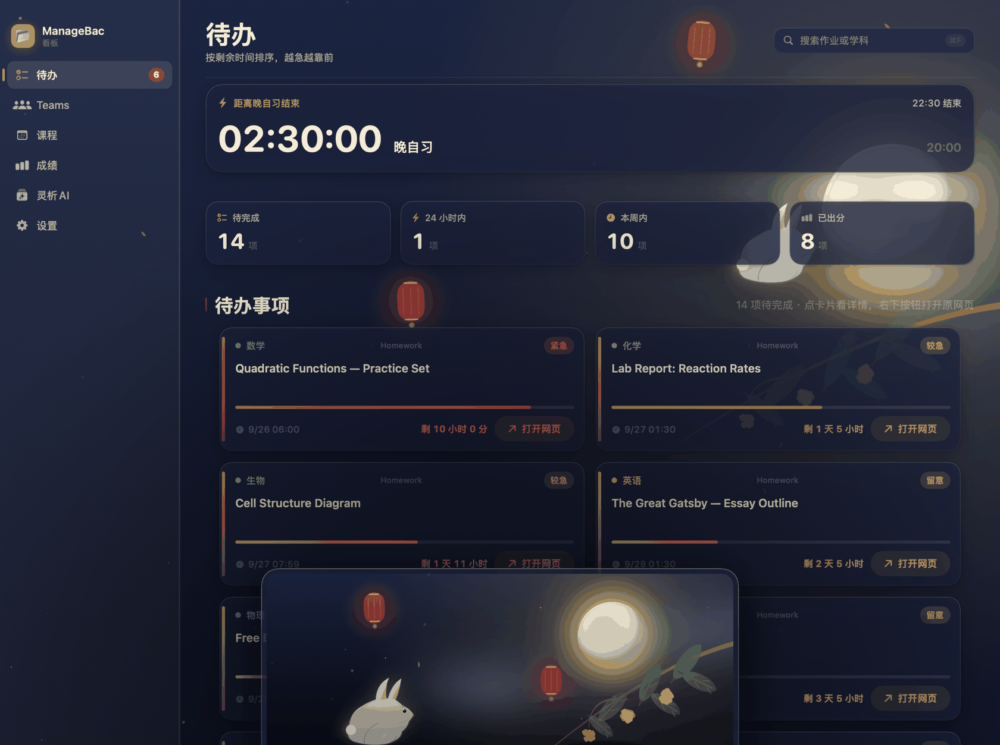
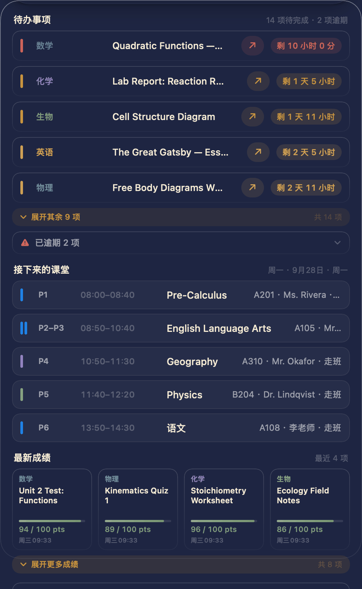

# ManageBac 看板

**把分散在四个平台上的学习信息，收进一个窗口。**

一个为北京 101 中学国际部学生做的 macOS 综合看板：作业、成绩、课表、Teams 消息、English Corner 名单，一处看完。


---

## 为什么做这个

我是北京 101 中学国际部的高中生。

国际部的日常有个麻烦：**作业在 ManageBac、消息在 Teams、活动在邮件里、课表又是另一份 PDF**。想确认一件事，得在四个平台之间来回切；每次切换都是一次注意力断裂——正写着作业，为了查一个截止时间，切出去、登录、翻页、找，回来已经忘了刚才在想什么。

于是我做了这个综合看板，让同学们可以无障碍地查阅最新数据。

后来发现「有一个地方能看全」还不够 —— 只要它是个需要主动打开的大窗口，就会打断手上正在做的事。所以又做了状态栏上那个**点按弹出的小看板**：想看数据，点一下，扫一眼，收起来。**不影响注意力，心流不断，数据也拿到了。**

这就是它的全部动机。

---

## 打开就能看到的四件事

侧栏四个分区，覆盖国际部学生每天真正要查的东西。

| | 分区 | 回答的问题 |
|---|---|---|
| ✅ | **待办** | 现在欠什么、还剩多久、哪条最急 |
| 👥 | **Teams** | 微软任务 / 邮件 / 日程里，哪些和学习有关 |
| 🗓 | **课程** | 今天第几节、在哪间教室、谁上 |
| 📊 | **成绩** | 各科总评、GPA、最新出了什么分 |

### 待办

顶部是一张大计时卡——它知道你现在是处于「距离晚自习结束」还是「课间休息」，按你的作息表切换。下面是概览磁贴（待完成 / 24 小时内 / 本周内 / 已出分）和作业卡片网格。每张卡片带一条**时间进度条**和紧急度标签：红色「紧急」、黄色「较急」、蓝色「留意」。逾期项自动收进折叠区。


### Teams

Teams 页做的事是**从噪音里捞干货**。课程消息、邮件、日程里散落着真正的学习任务——一条「周四实验课要带白大褂」的邮件，本质就是一条待办。这一页把微软任务、邮件、日程和 English Corner 名单横向拉通，再按课程和截止时间重新组织。


顶部的 English Corner 卡片会告诉你**今天要不要去、几点、在哪、名单里有没有你**——这是国际部每周都要查一次的信息。

### 课程

整日课表 + 本周全览两张视图。课表从学校导出的 PDF / Excel 里解析出来，所以「下一节是什么、在哪个教室、还有几分钟上课」是准的。


### 成绩

GPA 总览环 + 4 分制折算 + 各科明细 + 最新出分时间线。


---

## 五件我觉得值得单独说的事

### ① 通知：把「该知道」和「别吵我」分开

一个看板最容易失败的地方是**通知刷屏**——消息太多，用户直接关掉通知，于是这个功能等于不存在。

所以通知这块的可自定义程度做得比较高：总开关、按类型开关（作业 / 成绩 / Teams 任务 / 邮件 / 日程 / English Corner）、只提醒「紧急」档、提前多少小时提醒、学科白名单、免打扰时段、每日汇总、通知上要不要挂学科图标……


而真正决定它能不能长期用下去的，是背后这几条约束：

- **一个进程发通知。** 主看板和菜单栏面板是同一个二进制，不会同一条消息弹两遍。
- **永久去重。** 同一个 key 见过一次就永远不再播报，刷新多少次都不会旧事重提。
- **旧闻门槛。** 新成绩超过 4 天、Teams 任务超过 3 天、邮件超过 7 天，只记账不播报——不会出现「一周前的成绩被当成新成绩」。
- **静默播种。** 首次运行或状态文件丢失时，只记录现状、一条都不补播，避免历史账本瞬间全涌出来。
- **同轮合并。** 一轮里同一类超过 2 条就合成一条汇总（「🏆 4 条新成绩」），不再逐条轰炸。

通知图标按**学科配色 × 提醒类型**生成，所以在通知中心里扫一眼就知道是哪一科、什么事，不用读文字：


展开是这样：


### ② 灵析 AI：让 AI 能看见你的作业

普通 AI 对话框的问题是它不认识你——你问「我这周哪天会特别赶」，它只能反问你「请提供你的课表和作业」。

灵析 AI 把看板的数据直接挂进对话：作业待办、成绩、Teams 任务、希悦课表，都可以按需作为上下文交给它。所以它能回答的是这类问题：

> 「对照我的课表和作业，这周哪几天会特别赶？」
> 「我最近有没有漏掉 English Corner？下次是哪天？」


实现上它是「原生界面 + 隐藏网页引擎」：界面 100% 自绘（和看板其他部分是同一套配色、圆角、玻璃、密度零件，换主题时它跟着一起变，不会像贴上去的外挂），需要网页能力时用托管的 `WKWebView` 承载登录与请求。登录页就直接摊在窗口上，不需要你先知道背后有个隐藏浏览器。

### ③ 主题：五套，各是一个世界

不是换几个色号，而是**成套的配色体系**——背景、卡片、边界、强调色、状态色一起换。同一页在五套主题下的样子：


| 主题 | 气质 |
|---|---|
| **经典** Classic | 干净的蓝，最中性 |
| **红霞** EmberglowOS | 暖橙、粉与淡蓝层层过渡，校园黄昏 |
| **绿意** VerdantOS | 荷塘、林荫道的深绿与浅草绿 |
| **宣纸** InkOS | 朱砂、烟墨、月白宣纸 |
| **月圆** LunaOS | 桂影、月华、中秋夜色（深色专属） |

其中「月圆」是限时主题，带一整套可以互动的插画元素——月亮、桂枝、玉兔，以及**中秋夜专属的上线提示**：



### ④ 液态玻璃：让它像个真 App

macOS 26 的 Liquid Glass 材质贯穿整个界面——卡片、侧栏、按钮、菜单栏面板都是玻璃质感，能透出背后的内容。


这不是纯装饰。玻璃是有层次的：越靠近用户当前关注的东西越实、越背景的东西越透。深色下玻璃是冷调的墨蓝，浅色下是暖白，跟着主题一起变。

也做了无障碍让步。设置里有两个开关：

- **降低透明度** —— 玻璃退化为实色，在弱对比屏幕上字更清楚
- **减弱动效** —— 关掉悬停抬升、进场动画与过渡

### ⑤ 可靠性：看得见才敢信

这类看板最怕的不是功能少，而是**静默失效**——数据几天没更新、登录早过期了，界面却一切如常，你以为看到的是最新数据。

所以做了几件事：

**数据新鲜度可见。** 每页都标「更新于 X 分钟前」；数据停了会明说「数据停在 …」「登录已失效，数据未更新」。宁可让你知道它坏了，也不装作没事。

**抓取失败有降级。** 拿不到新数据时，展示上一次的快照并明确标注「这是上次抓到的」，而不是清空成空态让你以为你没有作业。

**构建链自检。** 每次构建都会逐字节比对「打进包里的后端」和「源码」是否一致——因为以前踩过「改了源码但包里还是旧的」，现象是修好的 bug 原样复现，极难查。还会校验签名、验证包内后端模块数量。

**渲染自检。** 项目里带一套离屏渲染工具（`--section` / `--panel` / `--live` / `--data` 等开关），可以把任意一页按任意主题、宽度、亮暗渲染成图来核对版式。其中 `--live` 会把页面放进一个屏幕外的真窗口跑几秒、逐帧比对相邻两帧——专治「定时器没在跑，但代码读起来毫无问题」这类盲区（首页那个大倒计时卡死不动，就是这么查出来的）。

**隐私默认安全。** 登录态、Cookie、浏览器 profile、抓取到的作业与课表全部只存在本机数据目录里，不进仓库。仓库里那份 `.gitignore` 每一条都写了「为什么不能上传」。

---

## 状态栏小看板

回到最开始的那个动机——**不打断心流**。

点状态栏图标，弹出一块小看板：待办、接下来的课堂、最新成绩，一屏扫完。


它也能独立跟随主题——包括深色的月夜：



和大看板是同一个 App、同一个后端、同一个通知来源，不存在两边数据不一致的问题。

---

## 安装

**环境要求**

- macOS 26.0 或更高
- Python 3（后端桥接服务）
- Google Chrome（无头抓取）

**构建**

```bash
cd board/mac
bash build.sh
```

构建产物会输出到 `~/Desktop/ManageBac 看板 For Mac/`，双击 `ManageBac 看板.app` 启动。输出位置可用环境变量覆盖：

```bash
MBBOARD_OUT=/somewhere bash build.sh
```

首次启动会引导你填学校地址、账号和密码，并自动完成环境准备（后端、抓取工具都会从 App 包里装到本机数据目录，不需要 `npm install`）。

**自检（可选）**

```bash
bash board/mac/render.sh --section todo --h 940 --out /tmp/x.png
```

---

## 项目结构

```
board/
  mac/          macOS 看板（SwiftUI 原生 + 多文件 swiftc 构建）
  shared/       后端共享模块（课表解析、希悦、EC 名单…）
  windows/      Windows 版（Electron）
menubar/        菜单栏面板（独立构建版；正式版已并入 mac 看板）
watch/          Apple Watch 版 + 表盘小组件
relay/          推送中转服务（手机端接收通知）
bridge.py       本地后端：抓取调度、登录态、缓存、推送
scrape.js       ManageBac 抓取脚本（无头 Chrome）
tools/          演示数据生成（README 截图用，全部虚构）
docs/           文档与截图
```

Mac 版约 35 个 Swift 文件、2.3 万行 Swift；后端 `bridge.py` 约 3600 行。

---

## 关于截图里的数据

README 里所有截图**都是用虚构数据渲染的**。

原因很直接：GitHub 上的图片删不干净（fork、缓存、爬虫都会留档），而真实的作业标题、成绩、课表里的老师姓名和教室号都是不该公开的信息。

所以截图流程固定为：

```bash
python3 tools/make-demo-cache.py    # 生成虚构数据到 docs/demo-data/
bash docs/shoot-readme.sh           # 用虚构数据渲染 docs/images/
```

`tools/make-demo-cache.py` 造出来的科目名、作业标题、成绩、教师姓名、教室号、邮件发件人全部是编的；渲染时通过 `--data` 把**整个数据目录**指过去，真实数据从头到尾不参与。你可以自己跑一遍验证。

---

## 说明

这是一个个人项目，出于自用与分享的目的开源。它依赖 ManageBac 与 Microsoft Teams 的网页界面，因此**上游页面改版可能导致抓取失效**——这不是 bug，是这类工具的固有宿命，遇到了只能跟着改。

供同学们参考、fork、自用。**请勿用于任何违反学校规定或服务条款的用途。**
